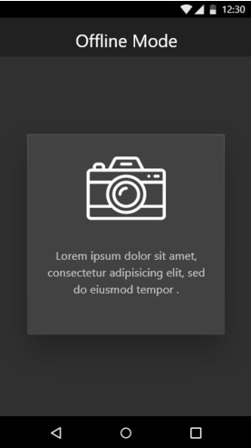

<h1 style="text-align: center">What's This</h1>

<i>What's This</i> is a Mobile Application that aims to help <strong>visually impaired</strong> people in our country to do some painful daily tasks. The App won the <strong>third price</strong> in the GDG's <strong>DevFest Hackathon</strong>. <a href="https://github.com/MehdiCHEBBAH/what-s-this">Check it on Github</a>

## Inspiration

We all have seen that **visually-impaired** person who walks in a store and has to seek people's help for distinguishing products s/he needs to buy (A process that is sometimes very painful for the person's self-esteem). So we needed to make something to make those people feel more independent. Especially for people in our country, Algeria, who cannot use Apps that require knowledge of English language.

## What it does

*What's this* allows its user to **scan an object** with a mobile phone camera. Then based on an **image classification AI model**. The app will tell the user what the object is (In our case, using the **Algerian dialect**, since many of our users do not speak or understand English) In the case our model fails to recognize an object, the app will permit the user to seek help from **volunteer users** (who have perfect vision) that will receive the object's picture and tell what it is.

## How we built it

We used **react native** to make the **front-end** part of the app. For the **back-end** of our prototype, we used **node.js** and the infamous "**clarify**" image classification api (A choice that would be compared to using our own model when building the final app). The results will be sent to a name-translation **database** (from English to Algerian dialect, in the case we make our own model, we could return the results in the desired language in the first place)

## Challenges we ran into

1.  Maybe the biggest issue with our program is the great diversity of the Algerian dialect as well as the existence of many variants of it (The same things may have many names depending on which region in Algeria you live). 

    >   The solution lies in the app providing as many different suitable name as possible for a given object then calling each of them to the user will, in case he does not understand, ask for another name of the same thing (If none are understood, he may use the seek help option) 

2.  Making a user experience that is friendly for people with visual  impairments. 

    >   The solution was to focus on **Gestures** instead of UI elements

## Accomplishments that we're proud of

We do not believe we can be proud of ourselves as long as we did not help actual people with actual problems. But if we were to be proud of something, it would be our app as a concept

## What's next for What's this

There exist in Algeria dialects that are fundamentally different from the Arabic variants known in most regions. though these are not the majority they are still a decent share of the Algerian population. It would be great for our diversity and inclusion objective to make our App friendly for these categories of people.

## Built With

-   [`firebase`](https://devpost.com/software/built-with/firebase)
-   [`javascript`](https://devpost.com/software/built-with/javascript)
-   [`node.js`](https://devpost.com/software/built-with/node-js)
-   [`react-native`](https://devpost.com/software/built-with/react-native)

